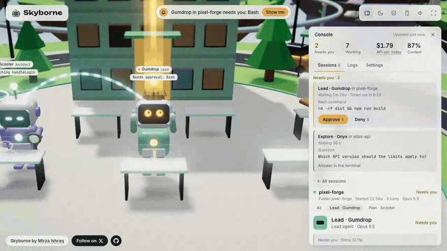
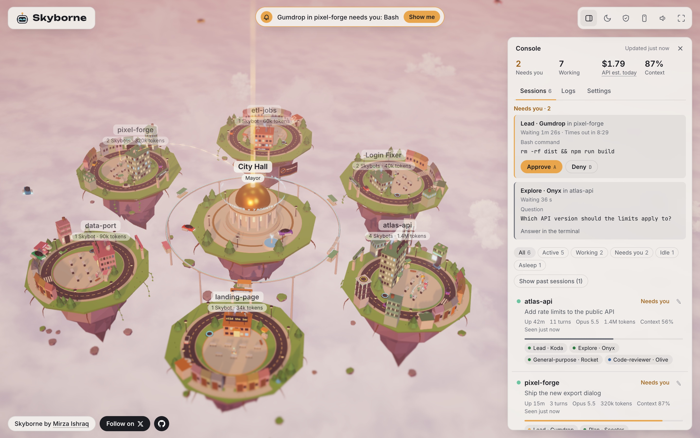
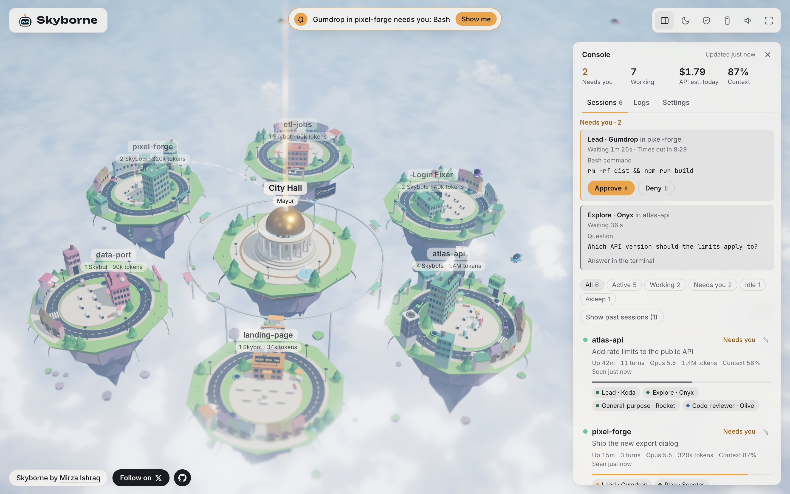
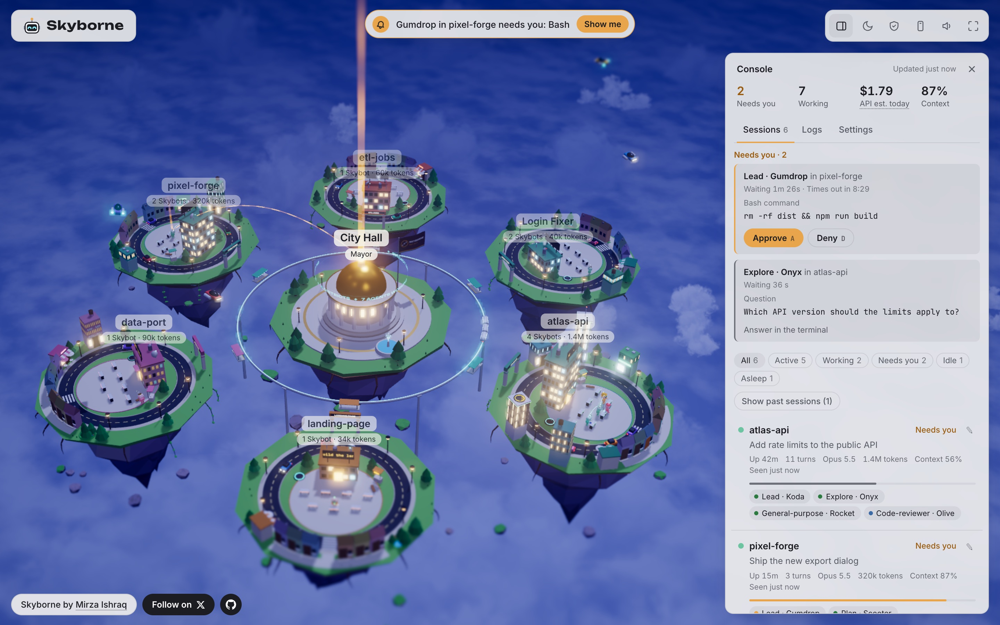

<p align="center"></p>

<h1 align="center">Skyborne</h1>

<p align="center">
  <a href="https://github.com/ishraq21/skyborne/actions/workflows/ci.yml"></a>
  <a href="https://pypi.org/project/skyborne/"></a>
  <a href="LICENSE"></a>
</p>

<p align="center"></p>

Watch your Claude Code agents work, live, in a 3D sky city. Each
session is a floating district and each agent is a little robot, a Skybot. See at a glance who's
working, who's stuck and who needs you, and approve or deny their requests right from the city.

Everything stays on your computer: no account, no cloud, and no telemetry (nothing is sent back to
anyone).

**Try it in your browser: [skyborne.dev](https://skyborne.dev).** It plays a recorded session in the city, so there is nothing to install.

> **Status: early.**

<a href="docs/images/city-dusk.jpg"></a>

<table>
  <tr>
    <td><a href="docs/images/city-morning.jpg"></a></td>
    <td><a href="docs/images/city-night.jpg"></a></td>
  </tr>
  <tr>
    <td align="center">Morning</td>
    <td align="center">Night</td>
  </tr>
</table>

## Why Skyborne?

Claude Code can run several sessions at once, and each can launch helper agents. From the terminal,
it's hard to tell what they're all doing. Skyborne puts them in one place:

- **See everything at once**: which sessions are working, which are idle and which are waiting for you.
- **Answer from one place**: approve or deny permission requests without hunting through terminals.
- **Know where time and tokens go**: how long each step took and how many tokens (the units Claude's
  usage is counted in) each agent used.
- **Look back**: open any of your 60 most recent sessions and walk through it step by step, even
  ones from past days.

## Features

### The city

Skyborne turns your Claude Code sessions into a living city in the sky.

- **A district per session**: each session is a floating island around City Hall, named after its
  project folder or a name you give it. Its tower grows a floor as the session uses more tokens.
- **Live, as it happens**: the city changes the moment Claude Code does something. A quiet district
  dozes off after 3 minutes and wakes up when its session does.
- **"Needs you" alerts**: when Claude asks permission, a banner at the top says who is asking, and
  **Show me** takes you to that Skybot. Desktop alerts can tell you even when the city isn't in
  front (off by default).
- **Morning, dusk and night**: the sky follows your clock, or press `T` to pick a time. Hover cars, a
  monorail and a blimp keep the sky busy, with sound effects on `M`.
- **Reel mode and Safe to film**: a portrait, phone-shaped view (9:16) for recording videos, and a
  switch that hides your prompts, files and project names.
- **History**: sessions are kept for 30 days, and the first run offers to bring in the last 7 days.

### Skybots

Every agent is a Skybot: a small robot that acts out what its agent is doing, so you can read the
city at a glance.

- **One per agent**: each session's lead, plus one for every helper it launches.
- **Homes for helpers**: each district has a row of six cottages. A helper steps out of its own
  front door when it starts (the lead waves hello if it's free), crosses the road at the zebra crossing,
  where cars stop for it, and walks home when it finishes. Its window lights while it's in. When all six
  houses are taken, a new helper beams down by the pad instead, and beams back up shortly after it finishes.
- **Their own names**: every Skybot gets a name, like Gumdrop or Onyx, and helpers show their role,
  like Explore or Plan.
- **Props for the job**: a book while reading, a magnifying glass while searching, orbiting lights
  while thinking, a spinning gear while using a tool.
- **Eyes that show status**: cyan while working, amber while waiting for you, red after an error,
  dim when asleep.
- **Moods**: in the zone after a few minutes of work, tired after 20 minutes, grumpy after repeated
  errors, bored when idle for a while, proud when they finish.
- **Moments**: when a lead finishes answering you, it does a victory dance in a burst of confetti and
  the free Skybots around it clap along. In quiet moments they wave to each other, stretch, yawn and
  take coffee breaks.
- **Asking for you**: a Skybot waiting for your approval shows an amber beam linked to City Hall,
  which turns green when you approve and red when you deny.
- **Click one** to see that agent's own steps, timeline and tokens.

### The console

The panel beside the city (`C` or the first icon in the top-right toolbar shows or hides it; the × in its header hides it) is where you read the details and act.

- **At a glance**: how many requests need you, how many Skybots are working, **Usage** (how much of
  your 5-hour limit you've used on a Pro or Max plan; on other plans, what today's sessions would
  cost at API prices) and **Context** (how close the fullest session is to filling Claude's working
  memory). Hover Usage to see where the tokens went, by session and by agent.
- **"Needs you" cards**: each request shows the exact command, file or address and how long it has
  waited, with **Approve** (`A`) and **Deny** (`D`).
- **Sessions**: every live session, with what needs you first, then errors, then anything slow.
  Filter by state (working, needs you, idle, asleep), search by name or folder, bring back past
  sessions, and rename a district.
- **Session detail**: click a session for a timeline of every step (how long each took, agent by
  agent), the conversation, the files changed, every approval and the tokens per agent. Click a step
  for its full input and output.
- **Logs**: every session's newest steps in one list, filtered by kind (prompts, tools, errors,
  replies, helpers) or by session, with how long each step took.
- **Settings**: your name on City Hall, how long a session counts as live, desktop alerts, time of
  day, Safe to film, sound, sample districts and playing a recording.

## Getting started

### What you need

- Python 3.11 or newer (uv, below, gets one for you if you don't have it)
- Claude Code
- `curl` (already on macOS, Windows 10 or newer and most Linux systems; `skyborne doctor` checks)
- A current browser: Chrome, Edge, Firefox or Safari

### Install

Skyborne installs with [uv](https://docs.astral.sh/uv/), a fast installer for Python programs. If you
don't have uv yet, install it first (then open a new terminal):

```sh
curl -LsSf https://astral.sh/uv/install.sh | sh                               # macOS or Linux
powershell -ExecutionPolicy ByPass -c "irm https://astral.sh/uv/install.ps1 | iex"   # Windows
```

(`brew install uv` and `winget install --id=astral-sh.uv -e` work too.) Then:

```sh
uv tool install skyborne
skyborne install
```

`uv tool install` puts Skyborne in a private Python environment of its own and the `skyborne` command
on your PATH (if the command isn't found, run `uv tool update-shell` and open a new terminal).
`skyborne install` then adds Skyborne's plugin to Claude Code. That asks whether to add Skyborne's
status line (the info line at the bottom of Claude Code); say yes to see Usage and Context in the
city. Use `uv tool install` as shown, not `uvx`: the status line remembers where Skyborne's Python
lives, and `uvx` keeps it in a cache that gets cleaned out.

Installed from a clone of this repository before? Run `skyborne uninstall` there first (as
`.venv/bin/skyborne uninstall`), then follow the steps above.

### Run

```sh
skyborne
```

The city opens at http://127.0.0.1:7317. Start Claude Code in another terminal and its session
appears as a new district. Sessions that were already open before you installed don't show up, so
start a new one.

### Update

Stop Skyborne first (`Ctrl+C` in its terminal), then:

```sh
uv tool upgrade skyborne
skyborne install
```

The second command makes the plugin match the new version (`skyborne doctor` tells you when it's
needed). If you run Skyborne on another port, add it: `skyborne install --port 7400`. Start Skyborne
again afterwards.

## Commands

| Command | What it does |
| - | - |
| `skyborne` | Starts Skyborne and opens the city |
| `skyborne --version` | Prints the installed Skyborne version and exits |
| `skyborne import --days 7` | Brings in past sessions from the history Claude Code keeps |
| `skyborne doctor` | Checks your setup and explains any problem |
| `skyborne record <id> --out demo.json --stand-ins` | Saves one session to a file the city can replay, with personal details scrubbed; read the text it lists before you share it |
| `skyborne uninstall` | Removes the plugin and puts your old status line back |

To remove Skyborne, run `skyborne uninstall`, then `uv tool uninstall skyborne`. Your history (prompts,
replies and tool calls, see [Privacy](#privacy)) stays in `~/.skyborne`: delete that folder too if you
want it gone, after `skyborne uninstall`, which needs what is in it.

## Keyboard shortcuts

| Key | Action |
| - | - |
| `R` | Reel mode (9:16, for filming) |
| `S` | Safe to film (hides prompts, files and project names) |
| `T` | Time of day |
| `M` | Sound |
| `C` | Console |
| `F` | Full screen |
| `A` / `D` | Approve or deny the "Needs you" card in focus |
| `↑` `↓` `Enter` `Esc` | In the console: move through a list, open, go back |

## Approving from the city

When Claude Code asks permission to run something, a **Needs you** card shows what it wants to do.
Click **Approve** or **Deny**. The terminal's own prompt still works at the same time, and whichever
you answer first wins.

- Skyborne never answers on its own. If nobody answers in the city within 10 minutes, it leaves the
  request to the terminal.
- Questions Claude asks you, and plans waiting for your OK, are answered in the terminal.
- Every answer is logged: what was asked, the answer, and where it was given.

## Privacy

Skyborne runs only on your computer. It listens on `127.0.0.1` (reachable from your machine only),
makes no requests to the internet and sends nothing back to anyone. The 3D engine and fonts come bundled.

It keeps what Claude Code reports, including your prompts, Claude's replies and every tool call, in
`~/.skyborne/skyborne.db`, in a folder only your account can open. Session data older than 30 days
is deleted. While Skyborne runs, other programs on this computer can reach it too, so don't run it
on a computer you share with people you don't trust. See [SECURITY.md](SECURITY.md).

If Skyborne isn't running, Claude Code works as usual: nothing waits or breaks (Skyborne's status
line, if you added it, still shows).

## Platforms

Tested end to end on macOS. The automated tests also pass on Linux and Windows, but Skyborne hasn't
been tried there with real Claude Code sessions yet. Details are in the
[guide](docs/GUIDE.md#platforms).

## Learn more

The [guide](docs/GUIDE.md) covers the rest: every view in the console, approval details, recordings,
settings, what is stored and known issues.

## Development

```sh
git clone https://github.com/ishraq21/skyborne.git
cd skyborne
python3 -m venv .venv                             # on Windows, use `python` and `.venv\Scripts\` in place of `python3` and `.venv/bin/`
.venv/bin/pip install -e '.[dev]'
.venv/bin/python -m pytest                        # unit tests, reducer evals, server, import, scrub and record tests
SKYBORNE_LIVE=1 .venv/bin/python -m pytest tests/live -s   # drives real Claude Code sessions (macOS/Linux)

cd page
npm ci && npx playwright install chromium         # once: three.js, the fonts and the test browser (Node 24)
node build.js                                     # builds the city into skyborne/web/ and dist/preview.html (commit both)
node dev/serve.js                                 # a preview with a fake city at http://127.0.0.1:8000/
node dev/icons.js                                 # remakes the tab icon's PNGs after a change to src/icons/icon.svg
node tests/smoke.js && node tests/live-smoke.js   # browser tests: the preview, then the real server
node build.js --site && node tests/site-smoke.js  # the demo site (page/site, not committed) and its test
```

This runs your checkout, not a version installed with uv: use `.venv/bin/skyborne install` and
`.venv/bin/skyborne` for it.

## Contributing

Contributions are welcome. Skyborne is for Claude Code only, runs only on your computer and has no
telemetry, so please read [CONTRIBUTING.md](CONTRIBUTING.md) before you start. Please follow the
[Code of Conduct](CODE_OF_CONDUCT.md), and report security problems privately, as
[SECURITY.md](SECURITY.md) describes.

## Author

Created by Mirza Ishraq. Blog: [my-space.io](https://my-space.io) · X: [@myspaceio](https://x.com/myspaceio)

## License

[Apache License 2.0](LICENSE). See [NOTICE](NOTICE) and [TRADEMARK.md](TRADEMARK.md).

Skyborne and the Skybot logo are trademarks of Mirza Ishraq Yeahia. Forks must use a different name
and logo.

Skyborne is an independent project. It is not made, endorsed or supported by Anthropic. Claude and
Claude Code are trademarks of Anthropic, PBC.
